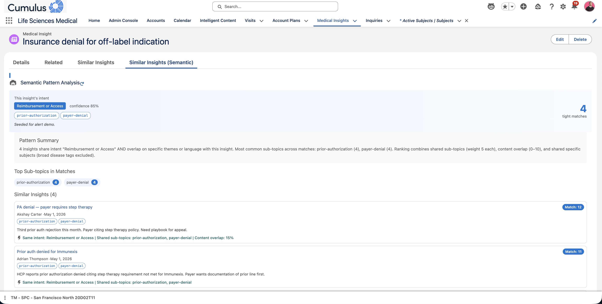
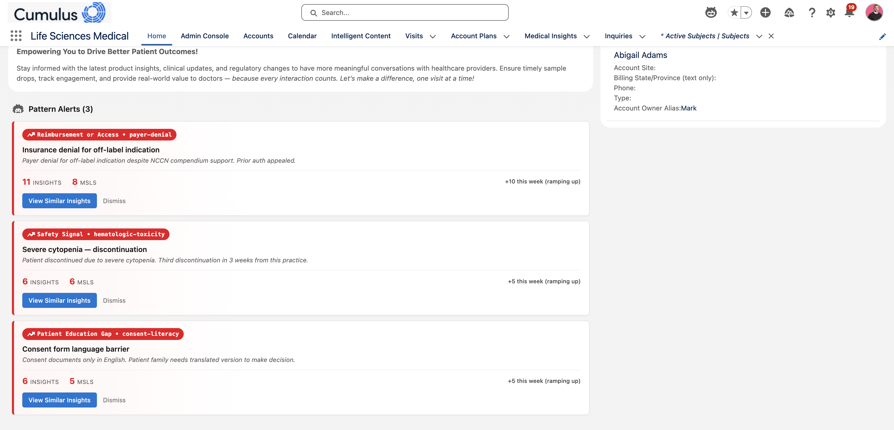

# Similar Insights: Semantic Matching

Find the *actually recurring* patterns across Life Sciences Cloud Medical Insights — not just records sharing the same subject tag.

This package augments the native LSC `MedicalInsight` object with an **intent + sub-topic classification** layer and a new similarity algorithm that combines LLM-assigned semantic tags with content-level overlap scoring. It ships additive — no existing LSC components are overwritten.

**Similar Insights (Semantic) on a MedicalInsight record page** — tight matches ranked by shared intent + sub-topics + content overlap, with a rationale on every match:



**Pattern Alerts on the home page** — surfaces trending intent+sub-topic clusters with MSL coverage and weekly trending deltas:



## What's in it

**Two components for your LSC org:**

| | |
| --- | --- |
| **Similar Insights (Semantic)** | Record-page component. Replaces "find insights sharing subject X" with "find insights asking the *same specific thing*." Every match shows an intent badge, sub-topic chips, and a rationale explaining why the two records grouped together. |
| **Pattern Alerts (Semantic)** | Home-page card. Surfaces intent+sub-topic clusters trending in the last 7 days, with MSL coverage, a centroid representative insight, and a weekly trending delta. |

**Under the hood:**

- Five custom fields on `MedicalInsight` — `Intent_Classification__c` (picklist), `Intent_Subtopics__c` (text), `Intent_Confidence__c`, `Intent_Rationale__c`, `Intent_Classified_At__c`
- `IntentClassifier` Apex — rule-based classifier, ships with 9 intents and ~35 sub-topics. Invocable from Flow so customers with Einstein can wire a Prompt Template for richer classification.
- `IntentInsightAnalyzer` Apex — ranks similar insights via intent match (hard gate) + shared sub-topics + content Jaccard similarity + specific-subject overlap
- `IntentPatternAlertController` Apex — bucket-aggregates the last 30 days by intent+sub-topic, scores trending against a 3-week baseline
- Apex trigger + Queueable — auto-classifies new/updated records asynchronously
- Pre-built Quick Action `Similar_Insights_Semantic` — wires a ScreenAction mobile button to the semantic component
- Permission set `Similar Insights Semantic User`

**Optional Einstein extension** in `ext-einstein/` — a `GenAiPromptTemplate` for Field Generation that outputs `{intent, subtopics, confidence, rationale}`. Deploy separately if your org has Einstein GPT provisioned.

## Install

### Deploy to Salesforce (one click)

<a href="https://githubsfdeploy.herokuapp.com/?owner=sreyamaram&repo=similar-insights-semantic-matching">
  
</a>

After deploy completes:

1. Assign the permission set:
   ```bash
   sf org assign permset -n Similar_Insights_Semantic_User -o <your-org-alias>
   ```
2. **Add the record page component.** Open any `MedicalInsight` record → gear icon → Edit Page → drag **Similar Insights (Semantic)** onto the page → Save & Activate.
3. **Add the home page alerts.** Home tab → gear icon → Edit Page → drag **Pattern Alerts (Semantic)** onto the page → Save & Activate.
4. **(Recommended) Swap the mobile quick action** to use the new component. Setup → Object Manager → Medical Insight → Buttons, Links & Actions → **View Similar Insights** → change the Lightning Web Component to `c:similarInsightsIntentAction` → Save.
5. **Backfill existing insights** so the components show results on existing data:
   ```bash
   sf apex run --file scripts/apex/backfill_intents.apex --target-org <your-org-alias>
   ```

### Deploy via CLI

```bash
git clone https://github.com/sreyamaram/similar-insights-semantic-matching
cd similar-insights-semantic-matching
sf project deploy start --source-dir similar-insights-semantic --target-org <your-org-alias>
sf org assign permset -n Similar_Insights_Semantic_User -o <your-org-alias>
```

### Install as an unlocked package

From your dev hub:

```bash
sf package create \
  --name "Similar Insights Semantic Matching" \
  --package-type Unlocked \
  --path similar-insights-semantic

sf package version create \
  --package "Similar Insights Semantic Matching" \
  --installation-key-bypass \
  --wait 20 \
  --code-coverage
```

Share the install URL; consumers run:

```bash
sf package install --package <04t...> --target-org <their-org> --wait 20
sf org assign permset -n Similar_Insights_Semantic_User -o <their-org>
```

## How the matching works

Two insights are considered similar when they clear three bars:

1. **Hard gate — same intent.** If two records don't share an `Intent_Classification__c` value, the analyzer won't even score them.
2. **Sub-topic overlap.** +5 per shared sub-topic (cap 15). Sub-topics are the fine-grained themes within an intent — e.g., within `Trial Access Barrier`: `site-availability`, `geographic-access`, `eligibility-criteria`, `enrollment-logistics`, `trial-financial`.
3. **Content overlap (Jaccard).** Word-set overlap × 10 (0–10). Tokenizes content, drops stop-words + broad clinical filler terms, computes `|A ∩ B| / |A ∪ B|`.
4. **Specific subject overlap.** +1 per shared subject (cap 3), with broad tags (`Oncology`, `TNBC`, `Disease Areas`) excluded so they don't dominate.

Minimum total score **8** to appear; top 15 returned. An insight can share `Oncology + TNBC + Access Barrier` with 50 other insights and still not show up as a "similar" match if the sub-topics and language diverge — that's the behavior that kills the "everything looks similar" problem.

## How the alerts work

Every 30-day window of classified insights gets bucketed by `(intent, subtopic)` pair. A bucket surfaces as an alert when:

- It has >= 3 insights, **and**
- Those insights span >= 2 distinct MSLs (kills single-rep false patterns)

The card shows:

- The bucket label (e.g., `Reimbursement or Access • prior-authorization`)
- Total insights in the window, MSL count, recent-week count
- Trending delta against the prior 3-week baseline (`surging`, `ramping up`, `up X% vs prior avg`, `steady`)
- The centroid insight — the one whose sub-topics overlap most with the rest of the bucket — as the card headline + preview text

Ranked by trending score, tiebroken by volume. Top 3 shown.

## Upgrading to Einstein-powered classification

Deploy the optional Prompt Template:

```bash
sf project deploy start --source-dir ext-einstein --target-org <your-org-alias>
```

Then build a Flow on `MedicalInsight` (after insert/update) that:

1. Calls the `Medical_Insight_Intent_Classification` Prompt Template with the insight title, content, and subjects
2. Parses the JSON response (`{intent, subtopics, confidence, rationale}`)
3. Calls the **Classify Medical Insight Intent** invocable action with those parsed values

When the Flow passes values, the invocable short-circuits the rule-based classifier. When Einstein is unavailable, the rule-based path runs so the package never falls over.

## Uninstall

```bash
sf package uninstall --package "Similar Insights Semantic Matching" --target-org <your-org>
```

## Development

```bash
# Run tests against a scratch org
sf apex run test --class-names IntentClassifierTest,IntentInsightAnalyzerTest,IntentClassifierQueueableTest,IntentPatternAlertControllerTest --code-coverage --wait 20

# Seed realistic alert data into a fresh org
sf apex run --file scripts/apex/seed_alert_patterns.apex --target-org <your-org-alias>

# Re-classify existing demo insights after a rules change
sf apex run --file scripts/apex/backfill_intents.apex --target-org <your-org-alias>
```

## License

BSD-3-Clause
